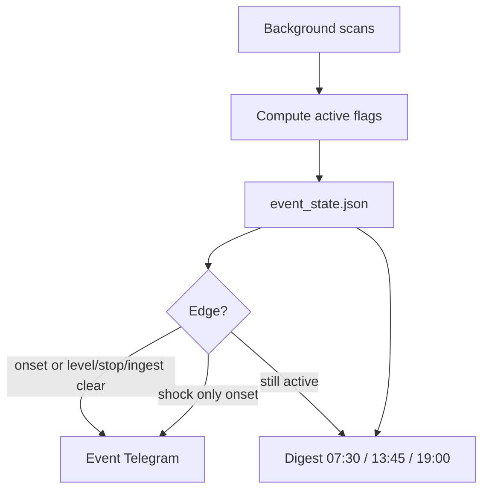

# 事件驅動推播＋固定 digest 計畫

## 目標

- **固定報**：一天 2～3 次，彙總商品／資金現況、進行中異常、待辦事項（不是每個 scan 都推）。
- **事件報**：僅白名單大型異常；**狀態 edge-trigger**（開始推、持續不推）。
- **波動／急貶**：只推「遭遇／開始」，**不推結束**。
- Level／破位／ingest：**開始＋結束**都推（結束有決策價值）。

現有多時段 Actions（preopen／intraday／multi_day／crypto_noon／close_confirm／eod／multi）改為：**背景掃描仍可跑，預設不推**；推播只走 digest 與 event bus。

---

## 固定時段建議（台北）

以台股 09:00–13:30、執行窗 ≥13:40、美股／晚上決策為主：

| 方案 | 時段 | 內容定位 | 建議 |
|------|------|----------|------|
| **A（2 次）** | **07:30**、**19:00** | 早：隔夜＋今日待辦預覽；晚：全日＋美股／加密收斂 | 最少打擾，符合「早晚各一」 |
| **B（推薦：3 次）** | **07:30**、**13:45**、**19:00** | 中午多一報：**收盤確認後的當日必做**（破防守／出清／不加碼） | 交易日最有用；假日跳過 13:45 |

**不要**再用 08:30／10:30／12:00／15:00／20:30 各推一輪固定摘要。  
背景 scan 可保留（例如 13:10 只寫 `event_state`、不推），真正推播只在上表＋事件。

### 為何是 07:30／13:45／19:00（不是整點 7／7）

- **07:30**：略晚於 07:00，美股 ETF／隔夜金匯較易齊；仍早於開盤冷靜期。
- **13:45**：對齊「13:10 收盤確認 → 13:40 後可執行」；比 14:15 舊 EOD 更贴近動作窗。
- **19:00**：美股已開一段、加密／晚間決策一次收斂；比 20:30 更早結束「今日資訊」。

Digest 固定骨架（每次相同）：

1. Level／可動用資金／部位摘要  
2. **進行中事件**一覽（含已開始未結束者）  
3. **今日需執行**（pending／playbook／出清）  
4. 一句「無新事件」或列出本窗口新 edge  

**實作預設採方案 B**；若只要兩次，config 關掉 `digest_close` 即可。

---

## 事件白名單與「不要太鬆」的定義

狀態檔建議：`reports/latest/event_state.json`  
欄位概念：`{event_id, active, since, last_change, meta}`。  
掃描算 `active` → 與上次比對 → `notify` 僅在 edge。

### 1) 大盤 Level（推開始＋結束／級距變更）

| | 定義（收緊） |
|--|--|
| **進入** | `macro_level` **從 1→2、1→3、或 2→3**（離散狀態變更，不是「又掃到仍是 2」） |
| **結束／降級** | **3→2、3→1、2→1** 各推一次「離開／降級」 |
| **不推** | 同 Level 持續；盤中暫估值若與 EOD levels 不一致，**以 EOD／close_confirm 寫入的 macro_level 為準** |
| **為何不鬆** | 一天最多數次狀態跳變；用整數 Level 而非乖離率連續觸發 |

### 2) TWD 單日急貶（只推開始）

| | 定義（收緊） |
|--|--|
| **觸發** | 相對**前一交易日收盤**，USD/TWD **漲幅 ≥ 0.40%**（維持 `alert_rules.thresholds.twd_alert_pct`） |
| **只推一次** | `event_id = fx_twd_shock_{YYYYMMDD}`；當日內不重複；**不推結束** |
| **不推** | 盤中未確認閃價；絕對匯率水準；「貶值趨勢延續」每日洗版（隔日若再 ≥0.4% 才算新日事件） |
| **為何不鬆** | 門檻已偏嚴；再加「每曆日最多 1 次」 |

### 3) 核心部位收盤破防守／年線（推開始＋站回結束）

| | 定義（收緊） |
|--|--|
| **標的範圍** | 僅 **portfolio 實體持倉**＋策略核心（如 00631L／已持有之 0050）；觀測未持有不進此事件 |
| **觸發** | **僅 close_confirm／EOD 收盤價**確認：破 **5 日低／既定防守** 或 **年線（依 playbook／holding_rules）**；盤中不開事件 |
| **結束** | 收盤**站回**該線；內資個股可選 **連續 2 日站回** 才 cleared（對齊兩日法則） |
| **不推** | 盤中刺穿；未持有觀測股；與 Level 文案重複（破位與 Level 分開 event_id） |
| **為何不鬆** | 收盤＋持倉過濾＋可選兩日確認 |

### 4) 加密／黃金劇烈波動（只推開始）

| | 定義（收緊） |
|--|--|
| **觸發** | 單日漲跌 ≤ 門檻：**金 -5%**、**BTC/ETH -8%**（現有 thresholds），**且**（持倉數量＞0 **或** 達 `grade_buy_policy` 可執行買門檻） |
| **只推一次** | `gold_shock_{date}` / `btc_shock_{date}` / `eth_shock_{date}`；**不推結束** |
| **不推** | 雜幣（PEPE 等）除非納入核心監控；「偏重不加碼」例行文案；未持有且未達買門檻 |
| **預設再收一層** | 加密急跌需同時 **價格＜50MA**；黃金可選偏離 20 日均線，避免趨勢完好時的單日陰線 |
| **為何不鬆** | 持倉／可執行過濾＋日 key 去重；門檻維持偏嚴 |

### 5) 資料倉／ingest 連續失敗（推開始＋恢復結束）

| | 定義（收緊） |
|--|--|
| **進入** | 同一 job（或 health）**連續失敗 ≥ 2 次**，或倉關鍵檔超過 TTL 且補抓仍失敗 |
| **結束** | 同範圍 **連續成功 ≥ 2 次** 且 health OK → 推「管線恢復」 |
| **不推** | 單次 timeout／偶發 402（rotator 已切 token）；成功後每一次綠燈 |
| **為何不鬆** | N=2 滯後，過濾雲端偶發 |

---

## 推播矩陣（總覽）

| 事件 | 開始 | 持續 | 結束 |
|------|------|------|------|
| Level 變更 | 推 | 不推 | 推（降級／回 L1） |
| TWD 急貶 | 推（當日 1 次） | 不推 | **不推** |
| 核心破位 | 推 | 不推 | 推（站回） |
| 金／幣急跌 | 推（當日 1 次） | 不推 | **不推** |
| ingest 故障 | 推（N≥2） | 不推 | 推（恢復） |

---

## 實作步驟（確認後再動工）

1. **新增** `src_scripts/event_bus.py`：讀寫 `event_state.json`、`transition()`、呼叫既有 `notify.py`。  
2. **新增** `src_scripts/build_daily_digest.py`：組早晚（＋可選 13:45）報文。  
3. **接入掃描**：`scan_black_swan`／`scan_position_levels`／`scan_multi_asset`／ingest health → 只更新事件；`alert_rules.notify_mode=event_digest` 關掉舊多時段吵推。  
4. **排程**：Actions／Droplet → `digest_am` 07:30、`digest_close` 13:45（交易日）、`digest_pm` 19:00；背景 13:10 close_confirm（寫事件）、ingest timers。  
5. **設定**：`alert_rules.json` 加 `digest_schedule`、`event_policies`（shock 不推結束、ingest_streak=2、crypto 需持倉或可買、below_50ma）。  
6. **文件**：更新 `CLOUD_ALERTS.md`／`DATA_INGEST.md`。

---

## 刻意不做（避免變鬆）

- 觀測評等 A/B/S、ladder 加碼、例行「可買進」→ **只進 digest**，不單獨事件推。  
- 盤中個股破防守、新聞標題刷屏 → 不推或僅 digest 一行。  
- 用降門檻換更多推播。

---

## 已確認（2026-07-18）

1. 固定報：**B — 07:30／13:45／19:00**（假日略過 13:45）  
2. 加密急跌：**強制同時 ＜50MA**  
3. 破位解除：內資個股 **兩日站回**；ETF／正2（年線）**一日站回**  

實作入口：`event_bus.py`／`eval_market_events.py`／`build_daily_digest.py`；`alert_rules.notify_mode=event_digest`；Actions 排程見 `.github/workflows/alerts.yml`。
